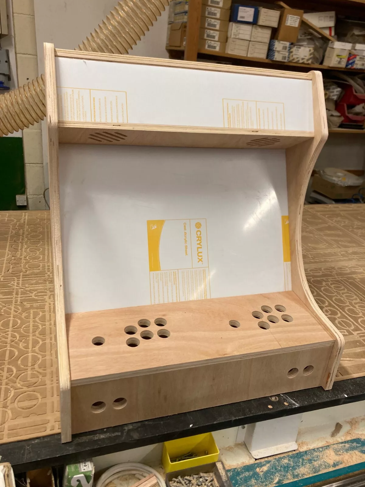
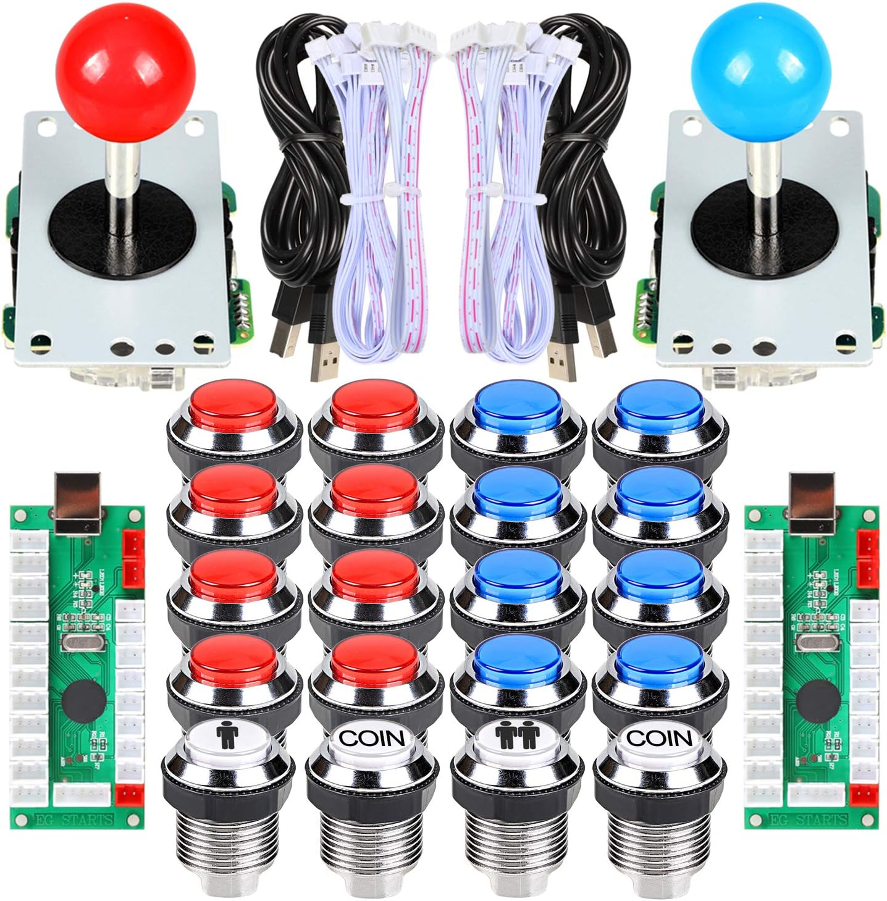

# Bartop Arcade Build
Notes and links used to build 

## Links

https://www.instructables.com/2-Player-Bartop-Arcade-Machine-Powered-by-Pi/

https://retropie.org.uk/forum/topic/18939/yet-another-arcade-bartop-do-it-yourself-guide-to-build-your-very-own-cabinet-with-raspberry-pi-and-retropie

https://www.tinyarcademachines.com/free-arcade-cabinet-diy-guide/

## Cabinet
Simple option of buying ready cut flatpack kit from eBay.
Bought from the seller [ell-s](https://www.ebay.co.uk/sch/i.html?item=156682869223&rt=nc&_ssn=ell-s) which sells a decently priced build with good reviews.


### Vinyl wrap
Cost £77

Bought the [Sega Nintendo Full Set](https://www.rockstarprint.co.uk/full-set-bartop-.html)


Reached out to and double-checked sizing with Rockstar print/arcade first regarding the cabinet sizing and got this reply.
```
Yes those sizes will be fine to order.
I will need the sizes for each of the panels either the 5 set or the 8 so max heights and widths for each please
```
Rockstar is the vinly provider that the ebay seller recommended


## Buttons
Cost £46

After having looked around all over the place and reading up on sticks and buttons, decided to start simple and
simply bought "EG STARTS 2 Player Arcade Buttons Arcade Contest DIY Retropie Cabinet Kit PC Game + LED Chrome Plating Arcade Buttons Mame Raspberry Pi Game Project" from Amazon



## Raspberry Pi
Have an old PI 4B at home, will start with this one.

### Software Install

First I tried the raspberry pi manager (https://www.raspberrypi.com/software/), but recently they stopped providing the RetroPie as an image option.

So instead I downloaded the image from here https://retropie.org.uk/download/ .

Then used the raspberry pi manager to install the RetroPie image on an SD card.

Plugged the pi into a monitor and it started up just fine.


## Monitor
Planning to wait with buying this until I can properly measure the cabinet.

Cabinet accepts flat screen monitor Size, up to 56.4cm wide x 35.5cm high
(i.e. most 24" widescreen)

Candidates

https://ao.com/product/umqq0ee104-acer-nitro-qg241yx1bmiipx-gaming-monitor-black-105788-766.aspx


Dimensions (cm): H32.4 x W54.1 x D6.6


https://www.scan.co.uk/products/245-msi-pro-mp251w-e2-business-monitor-ips-1920x1080-adaptive-sync-1ms-120hz-15001-300cd-m-hdmi-dp-v

£69

Speakers 2Wx2

556.89 x 42.94 x 321.49 (WxHxD)

https://www.scan.co.uk/products/238-benq-gw2490-monitor-ips-1920x1080-5ms-100hz-13001-250cd-m-hdmi-dp

£80

Speakers 2Wx2

540 x 343 x 61 (WxHxD)


https://www.scan.co.uk/products/iiyama-24-g-master-g2441hsu-b1-144hz-hd-gaming-display

£89

## Speakers

Starting with the monitor's built-in speakers, will see later if we upgrade. 